# HR Recruitment System


A role-based recruitment management web application built with **ASP.NET Core MVC (.NET 10)** and **SQL Server**. HR staff publish vacancies, manage applicants and schedule interviews; interviewers record results and feedback; applicants register, apply for jobs and track their applications.

**Live Demo:** https://hr-recruitment.runasp.net/
**GitHub Repository:** https://github.com/kashmala123/HR-Recruitment

**Highlights:** C# · ASP.NET Core MVC · Entity Framework Core · SQL Server · Cookie authentication with role-based authorization · Email integration (SMTP) · File uploads · Deployed on MonsterASP with HTTPS

---

## Overview

The application digitizes a basic hiring pipeline for three kinds of users. Each role gets its own panel and layout, and access is enforced on the server with ASP.NET Core role-based authorization.

- **HR** creates vacancies, manages applicants, attaches applicants to vacancies, schedules / reschedules / cancels interviews and views recruitment reports.
- **Interviewers** see the interviews assigned to them and submit a result and written feedback.
- **Applicants** register, browse open vacancies, apply, and follow the status of their applications and interviews.

A public marketing site (Home, About, Services, Team, Testimonial, Contact, Newsletter) sits in front of the application.

---

## Key Features

### Public Website
- Home, About, Services, Team, Testimonial and Contact pages
- Contact form that sends an email
- Newsletter subscription with an unsubscribe link
- Custom 404 page

### Applicant Panel
- Self-registration and login
- Browse open vacancies and view vacancy details (available after login)
- Apply for a vacancy
- "My Applications" page showing application status and interview status
- Profile management with profile-picture upload
- Notifications, change password, and forgot-password flow
- Help / FAQ page

### HR Panel
- Dashboard with vacancy, applicant and interview counts, today's interviews, and charts
- Create, edit and change the status of vacancies; search and filter
- Create and edit applicants, including optional resume upload (PDF / DOC / DOCX)
- Attach applicants to vacancies
- Schedule, reschedule and cancel interviews, with a check that prevents double-booking an interviewer
- Interview list with date and status filters, plus interview details
- Vacancy and Interview reports (the Hiring and Applicant report cards are shown in the UI as "coming soon")

### Interviewer Panel
- "My Interviews" list of scheduled interviews, with search
- Interview details including applicant and vacancy information
- Submit an interview result (Selected / Rejected) with feedback
- Completed-interviews history
- Read-only views of vacancies and applicants
- Profile and change password

### Email & Notifications
- Contact form and newsletter emails
- Interview scheduled / rescheduled / cancelled emails to the interviewer and applicant
- Interview result email to the applicant
- Password recovery email (a temporary password is emailed to the user)
- Account email (with a temporary password) when HR creates an applicant
- In-app notification feed for applicants, HR and interviewers

### Authentication & Security
- Cookie authentication with role-based authorization (`HR`, `Interviewer`, applicant)
- PBKDF2 (HMAC-SHA256, per-user salt) password hashing
- Anti-forgery validation on form posts
- Server-side validation of uploaded files (type and size)
- Activity logging for user actions such as login
- HTTPS redirection and HSTS outside the Development environment

---

## Roles & Permissions

| Action | HR | Interviewer | Applicant |
|---|:---:|:---:|:---:|
| Create / edit vacancies and change vacancy status | ✓ | | |
| View vacancies | ✓ | ✓ (read-only) | ✓ (after login) |
| Register an account | | | ✓ |
| Create / edit applicants | ✓ | | |
| View applicants | ✓ | ✓ (read-only) | |
| Attach applicants to vacancies | ✓ | | |
| Apply for a vacancy | | | ✓ |
| Track own applications | | | ✓ |
| Schedule / reschedule / cancel interviews | ✓ | | |
| View interviews | ✓ (all) | ✓ (assigned) | ✓ (own, via My Applications) |
| Submit interview result and feedback | | ✓ | |
| View recruitment reports | ✓ | | |
| Profile, change password, notifications | ✓ | ✓ | ✓ |
| Forgot-password recovery | ✓ | ✓ | ✓ |

---

## Technology Stack

| Layer | Technologies |
|---|---|
| **Backend** | C#, ASP.NET Core MVC, .NET 10, Razor views, SMTP email (`System.Net.Mail`) |
| **Frontend** | HTML5, CSS3, JavaScript, Bootstrap 5, Font Awesome, jQuery + jQuery Validation, Chart.js, SweetAlert2 |
| **Database** | Microsoft SQL Server, Entity Framework Core 10 (code-first migrations) |
| **Authentication** | ASP.NET Core cookie authentication and role-based authorization, PBKDF2 password hashing |
| **Deployment** | MonsterASP hosting (.NET 10, SQL Server), Let's Encrypt HTTPS, HTTP → HTTPS redirect |
| **Development tools** | Git, GitHub, Visual Studio / VS Code, EF Core CLI tools |

---

## Architecture

The application is a single ASP.NET Core **MVC** project: controllers handle requests and enforce authorization, Entity Framework Core accesses SQL Server, and Razor views render role-specific layouts.

```text
HR-Recruitment/
├── .gitignore
├── README.md
├── screenshots/                  # README images
└── HRRecruitment/                # ASP.NET Core MVC project (.NET 10)
    ├── Controllers/              # Account, Home, HR, Interviewer, Newsletter, UserPanel
    ├── Models/                   # Entities (Vacancy, Applicant, Interview, Employee, ...)
    │   ├── Data/                 #   ApplicationDbContext
    │   ├── Services/             #   Email, password hashing, activity logging, number generation
    │   └── Filters/              #   NoCache attribute
    ├── ViewModels/               # View models for forms, dashboards and reports
    ├── Views/                    # Razor views: Account, Home, HR, Interviewer, UserPanel, Shared
    ├── Migrations/               # EF Core migrations
    ├── wwwroot/                  # CSS, JS, images, client libraries, upload folders
    ├── Properties/               # launchSettings.json
    ├── appsettings.json          # Placeholder configuration (no secrets)
    ├── Program.cs                # Service registration, middleware, startup migration and seed data
    └── HRRecruitment.csproj
```

---

## Recruitment Workflow

```text
HR creates a vacancy
        ↓
Applicant registers and browses open vacancies
        ↓
Applicant applies           (HR can also create applicants and attach them to a vacancy)
        ↓
HR reviews the application and schedules an interview
        ↓
Interviewer and applicant receive an email
        ↓
Interviewer submits result (Selected / Rejected) and feedback
        ↓
Applicant status and vacancy openings update automatically; applicant is emailed the result
        ↓
HR reviews interviews and reports
```

When an applicant is marked **Selected**, the vacancy's remaining openings decrease and the vacancy closes automatically when no openings remain.

---

## Database

The app uses **Microsoft SQL Server** through **Entity Framework Core** with a code-first approach. The schema is managed by migrations in `HRRecruitment/Migrations/`.

Main entities: `Department`, `Employee` (HR and Interviewer accounts), `Vacancy`, `Applicant`, `ApplicantVacancy` (an application), `Interview`, `EmailNotification`, `Subscriber`, `UserActivityLog` and `ApplicantActivityLog`.

On startup `Program.cs` applies pending migrations (`Database.Migrate()`) and seeds departments, sample vacancies and demo accounts if the tables are empty.

---

## Screenshots

All screenshots are taken from the running application.

### Public Website

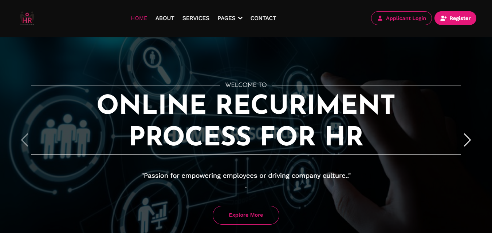

### Authentication

<table>
  <tr>
    <td width="50%">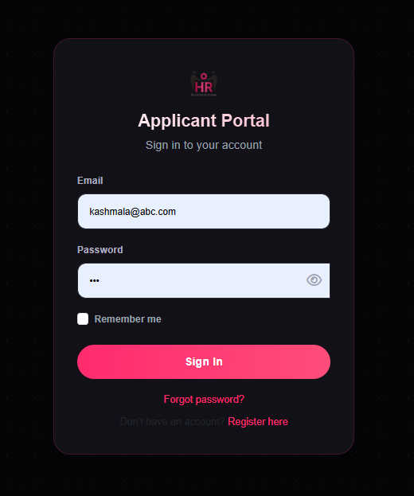</td>
    <td width="50%">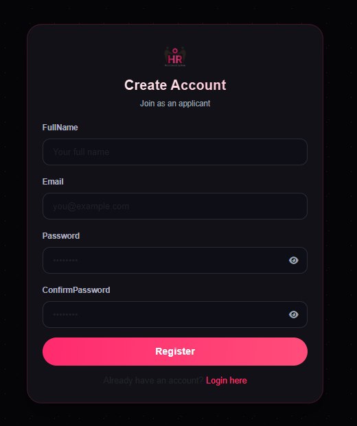</td>
  </tr>
  <tr>
    <td align="center"><sub>Login</sub></td>
    <td align="center"><sub>Applicant registration</sub></td>
  </tr>
</table>

### HR Panel

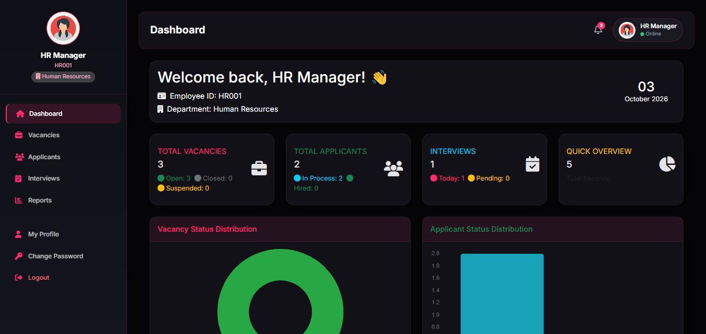

<table>
  <tr>
    <td width="50%">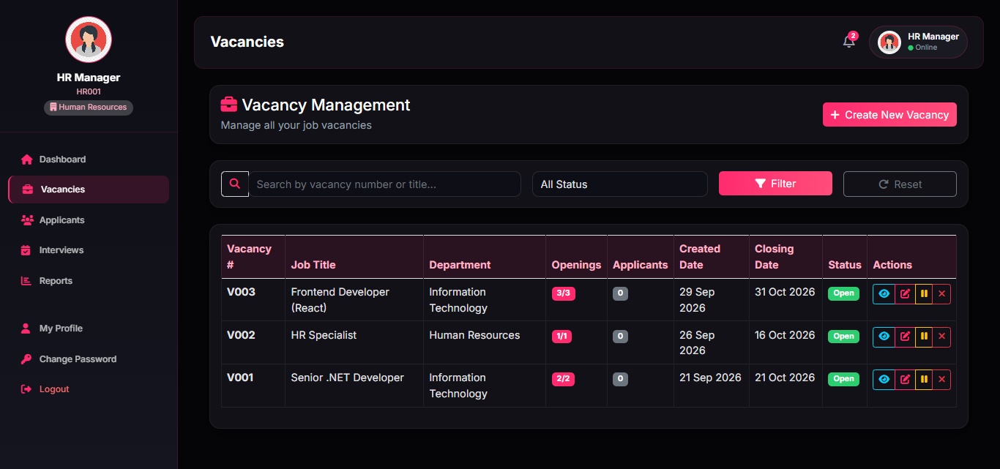</td>
    <td width="50%">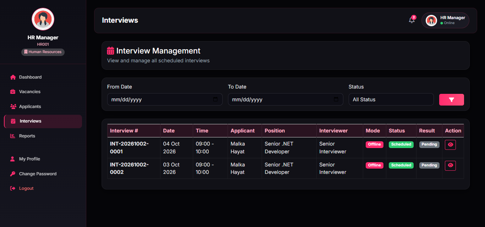</td>
  </tr>
  <tr>
    <td align="center"><sub>Vacancy management</sub></td>
    <td align="center"><sub>Interview management</sub></td>
  </tr>
  <tr>
    <td width="50%">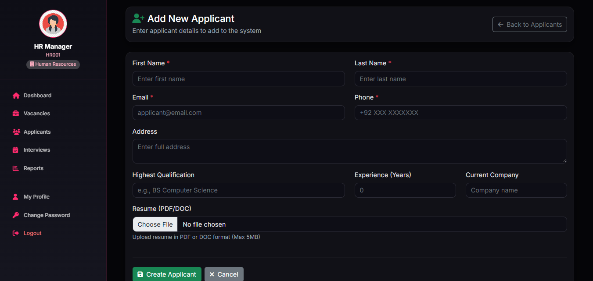</td>
    <td width="50%">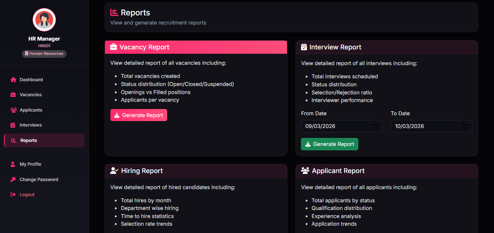</td>
  </tr>
  <tr>
    <td align="center"><sub>Add new applicant (with resume upload)</sub></td>
    <td align="center"><sub>Reports</sub></td>
  </tr>
</table>

### Applicant Panel

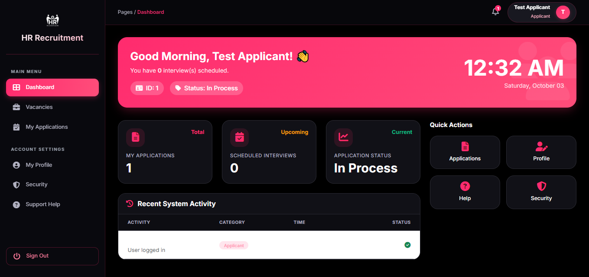

<table>
  <tr>
    <td width="50%">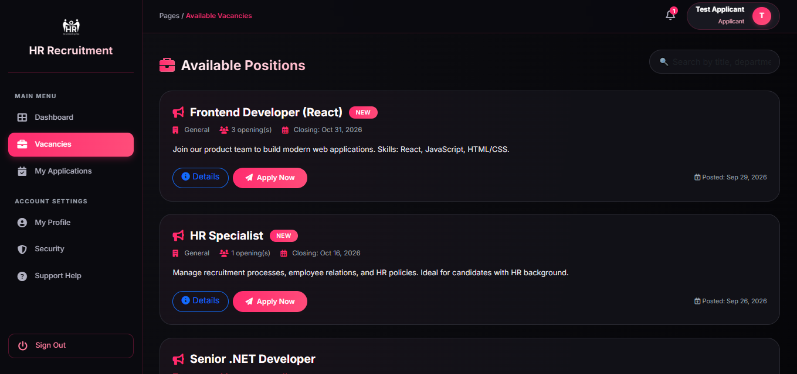</td>
    <td width="50%">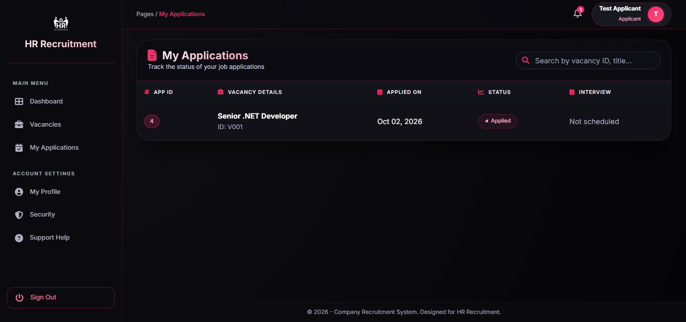</td>
  </tr>
  <tr>
    <td align="center"><sub>Available positions</sub></td>
    <td align="center"><sub>My applications</sub></td>
  </tr>
</table>

### Interviewer Panel

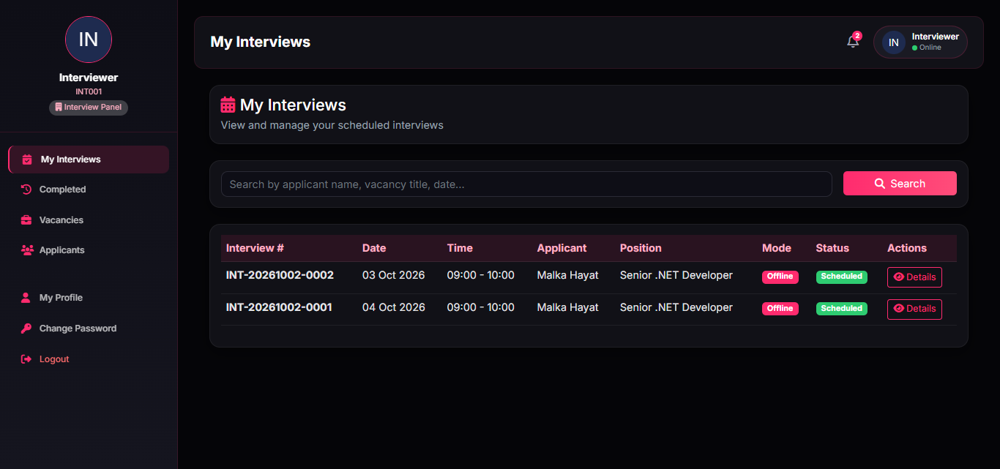

---

## Local Setup

### Prerequisites

- [.NET 10 SDK](https://dotnet.microsoft.com/download)
- SQL Server (LocalDB, Express, or a full instance). The default connection string targets **SQL Server LocalDB**, which is Windows-only; on other platforms point the connection string at another SQL Server instance.
- Visual Studio, VS Code or Rider (optional)

### 1. Clone and restore

```bash
git clone https://github.com/kashmala123/HR-Recruitment.git
cd HR-Recruitment/HRRecruitment
dotnet restore
```

The project lives in the `HRRecruitment` subfolder, so run the remaining commands from there.

### 2. Configure the database

`appsettings.json` ships with a LocalDB connection string for development (`Server=(localdb)\MSSQLLocalDB;Database=HRRecruitment;...`). To use a different SQL Server, override it with your own value using User Secrets (see step 3) rather than editing committed files.

### 3. Configure email (optional)

Email is used by the contact form, newsletter, interview notifications and password recovery. The app runs without it, but those features will not send mail.

`appsettings.json` contains placeholders only. Supply your own SMTP settings securely with [User Secrets](https://learn.microsoft.com/aspnet/core/security/app-secrets) (the project does not define a `UserSecretsId` yet, so initialize it first):

```bash
dotnet user-secrets init
dotnet user-secrets set "EmailSettings:SmtpUsername" "<your-smtp-username>"
dotnet user-secrets set "EmailSettings:SmtpPassword" "<your-smtp-password-or-app-password>"
dotnet user-secrets set "EmailSettings:FromEmail" "<your-from-address>"

# Optional: use your own SQL Server instead of LocalDB
dotnet user-secrets set "ConnectionStrings:DefaultConnection" "<your-connection-string>"
```

The default SMTP server is `smtp.gmail.com:587`; with Gmail you need an App Password. Environment variables such as `EmailSettings__SmtpPassword` work as well.

### 4. Migrations

Migrations are applied automatically when the app starts (`Database.Migrate()` in `Program.cs`), so no manual step is normally needed. To apply them manually you can install the EF Core CLI and run:

```bash
dotnet tool install --global dotnet-ef
dotnet ef database update
```

### 5. Run

```bash
dotnet run --launch-profile https
```

The app listens on `https://localhost:7255` and `http://localhost:5140` (see `Properties/launchSettings.json`).

> The application seeds demo accounts and sample data on startup when the relevant tables are empty.

---

## Deployment

The production site is hosted on **MonsterASP** and runs on **.NET 10** with a **SQL Server** database. It is served over **HTTPS** with a **Let's Encrypt** certificate, and HTTP requests are redirected to HTTPS.

**Live URL:** https://hr-recruitment.runasp.net/

---

## What This Project Demonstrates

- **ASP.NET Core MVC and C#**: controllers, Razor views, view models, dependency injection, middleware
- **Entity Framework Core and SQL Server**: relational modelling, code-first migrations, LINQ queries, startup seeding
- **Authentication and authorization**: cookie authentication and role-based access (HR / Interviewer / Applicant)
- **Secure credential handling**: PBKDF2 password hashing, anti-forgery tokens, temporary-password recovery
- **CRUD and business rules**: vacancies, applicants, applications, interviews, double-booking prevention, automatic vacancy closing
- **Form validation**: server-side validation with jQuery client-side validation
- **File uploads**: profile pictures and applicant resumes with type and size checks
- **Email integration**: SMTP-based notifications for interviews, results, contact, newsletter and password recovery
- **Reporting and dashboards**: summary counts, charts and report pages
- **Git / GitHub and production deployment**: hosted on MonsterASP with a Let's Encrypt HTTPS certificate

---

## Security Notes

- This repository must not contain real database passwords, SMTP / Gmail passwords or App Passwords, API keys, tokens or secret connection strings. `appsettings.json` contains placeholders only.
- Configure sensitive values with User Secrets, environment variables, or your hosting provider's secure configuration, never in committed files.
- If a secret is ever committed by mistake, rotate it immediately; deleting it in a later commit does not remove it from Git history.
- Uploaded profile pictures and resumes are written to `wwwroot/uploads/` and are excluded from Git by `.gitignore`.

---

## Developer

**Kashmala Khan**  
Full-Stack Developer focused on C#, ASP.NET Core, SQL Server, and web application development.

GitHub: [@kashmala123](https://github.com/kashmala123)

---

*Provided for educational and portfolio use.*
